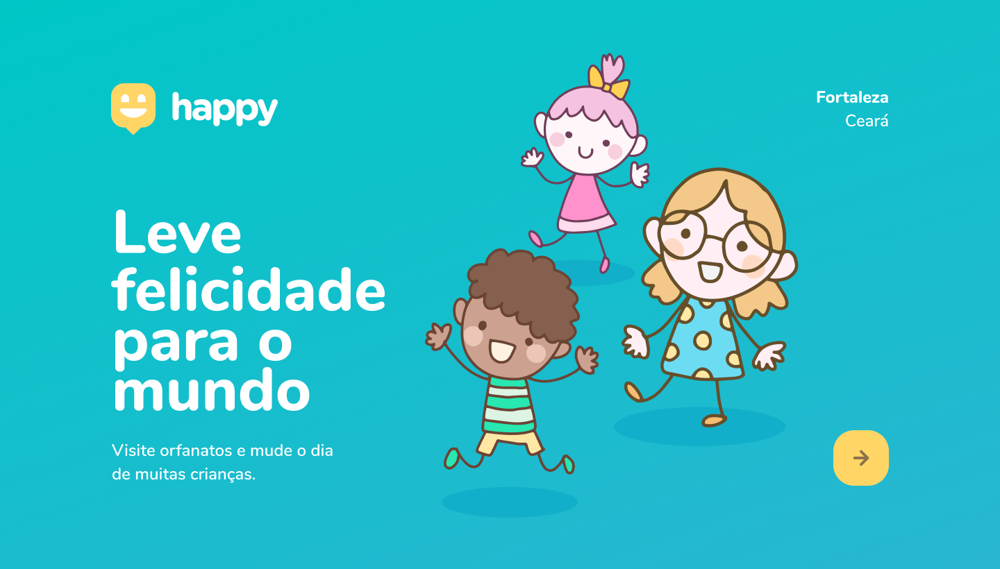

<h1 text-aling="center">Next Level Week, terceira edição, projeto "Happy"</h1>

O projeto Happy, desenvolvido durante a Next Level Week, da Rocketseat , de 12 a 18 de outubro.
O projeto é inspirado em instituições de caridade, que realizam trabalhos muito importantes no mundo. E tem como objetivo incentivar as crianças a visitar casas de acolhimento, o que é uma coisa linda ver a felicidade das crianças.

<h1> Tecnologias</h1>
<strong>Esse projeto foi desenvolvido utilizando as seguintes tecnologias:</strong>
<ul>
 <li>Node.js</li>
<li>Express</li>
<li>SQLite</li>
<li>handlebars</li>
<li>JavaScript</li>
<li>CSS</li>
<li>HTML</li>
</ul>

<h2>Desafios e aprendizados ao longo do caminho</h2>

Next Level Week, como muitos sabem, não é uma piada, requer prática, intensidade e acima de tudo, muito foco!
Felizmente estou indo bem e quero fazer uma semana ainda melhor que a anterior, porque afinal, como o mesmo nome diz, devemos estar sempre em busca do próximo nível e ser melhores a cada dia!

<h2>Layout</h2>
Você pode visualizar o layout do projeto através dos links abaixo:
<a href="https://www.figma.com/file/mDEbnoojksG4w8sOxmudh3/Happy-Web ">Layout Web</a>.

Lembrando que você precisa ter uma conta no Figma para acessá-lo.

